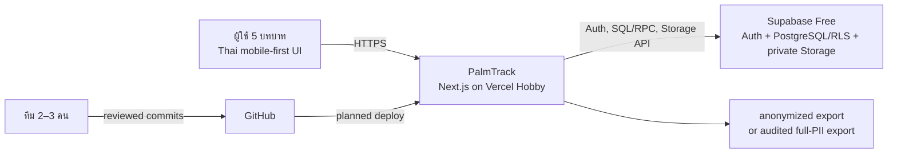
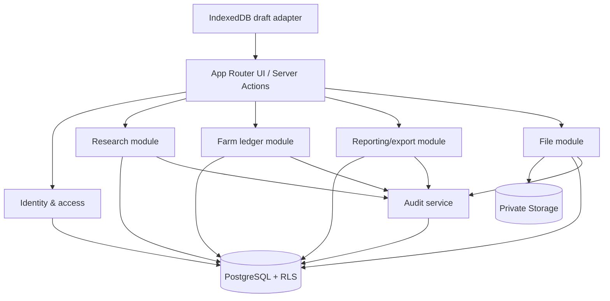

# Architecture

## System context

Vercel, Supabase และ GitHub เป็น deployment boundary ที่วางแผน ไม่ใช่ resource ที่มีอยู่ ดูข้อจำกัดและ recovery ใน [deployment runbook](DEPLOYMENT_RUNBOOK.md)

## Component model

## Modular boundaries

- **Identity & access**: Supabase Auth identity, profile, role, workspace membership และ authorization context ไม่กำหนด business transition
- **Research**: population, sampling run/version, sample member, assignment, consent, questionnaire metadata, response/review/withdrawal เป็นเจ้าของ workflow และ invariant ใน [research protocol](RESEARCH_PROTOCOL.md)
- **Farm ledger**: farmer, farm, plot, activity, expense, harvest, sale และสูตรใน [data model](DATA_MODEL.md)
- **Reporting/export**: read model จาก authorized query; ไม่เก็บยอดที่ขัดกับ ledger และใช้ analysis eligibility เดียวกับ protocol
- **File**: object metadata, purpose, owner aggregate, private signed access อายุสั้น และ delete policy
- **Audit**: append-only event สำหรับ privileged/semantic changes; module ต้นทางส่ง actor, action, subject, reason, before/after ที่ลด PII

### Farm Core + Cash Ledger implementation boundary — 2026-08-26

Production routes `/app/gardens` และ `/app/garden-account` ใช้ server action → validated service → Supabase RPC เท่านั้น Authenticated role ไม่มี direct table privilege; RPC แบบ `security definer` derive profile/workspace/role จาก session แล้ว join ownership ทุกครั้ง ตัวเลข `numeric` ข้าม PostgREST เป็น canonical decimal string เพื่อไม่ผ่าน IEEE-754 `Number` ส่วน database เป็นผู้คำนวณ gross/net และ period aggregate ขั้นสุดท้าย

Slice นี้มี `farmer`, `farm`, `plot`, `expense`, `sale`; ยังไม่มี `activity`, `harvest`, collector baseline mutation, offline ledger draft หรือ multi-tenant selector จึงคง module seam เดิมไว้โดยไม่สร้าง interface ลวง

ห้าม module query table ภายในของอีก module เพื่อเลี่ยง policy; ใช้ typed service/query contract ภายใน modular monolith Transaction ที่คร่อม invariant ต้องอยู่ server-side function/service เดียว

## Request and data flows

### Authorized write

Browser ส่ง validated input พร้อม auth session → server ตรวจ schema/role/object scope → PostgreSQL transaction ทำ row lock/constraint/status transition ภายใต้ RLS → เขียน audit ใน transaction เดียวกัน → ส่งผลลัพธ์ที่ไม่เปิดเผย PII เกินสิทธิ์ Client-side role check มีไว้ปรับ UX เท่านั้น

### Sampling and response

Population snapshot ที่ผ่าน validation → workspace sampling run `draft` → largest-remainder allocation → deterministic selection `sha256-mulberry32-fy-v1` → `locked` → activate (supersede active เดิม) → assignment → present privacy notice → consent `granted|declined` หาก granted จึง baseline/response `draft → submitted`; manager ทำ `submitted → returned|verified` หาก returned collector ทำ status-only `returned → draft` ที่ห้ามเปลี่ยน content/baseline แล้ว edit ใน request ถัดไปและ submitใหม่ Verified correction คือ manager `verified → returned` พร้อม reason โดยไม่แก้ answer แล้วใช้ collector/resubmit/re-verify loop เดิม Withdrawal จาก exactly `draft|submitted|returned|verified` เป็น terminal และตัด response จาก collection/read model ทันที Declined/cancelled run ไม่ถูกเลือก Current analysis ใช้ active run exactly one/workspace; historical analysis ต้องเลือก superseded run รายละเอียดอยู่ใน [research protocol](RESEARCH_PROTOCOL.md)

### Offline draft

เมื่อกรอกแบบฟอร์ม response UI บันทึก draft ที่ device-local IndexedDB โดยใช้ opaque draft ID, questionnaire version และ non-sensitive progress เท่าที่จำเป็น Draft ไม่ถือเป็น server record, ไม่ได้รับ assignment ใหม่, ไม่ resolve conflict และไม่ submit ขณะ offline เมื่อ online ผู้ใช้กดส่ง ระบบ revalidate auth, assignment, consent, questionnaire version และ idempotency key จากนั้นจึงลบ local draft เมื่อ server ยืนยันสำเร็จ การถอน consent หรือ assignment เปลี่ยนทำให้ draft ส่งไม่ได้และ UI อธิบายทางเลือกให้ลบทิ้ง

### Files

Client ขอ upload intent → server ตรวจ role/purpose/aggregate → ออก path ที่ไม่ใช้ชื่อ/เลขประจำตัว → upload ไป private bucket → server บันทึก metadata/checksum Upload ที่ไม่มี metadata สำเร็จต้องถูก cleanup ตาม runbook Download ขอ signed URL อายุสั้นหลัง object authorization ทุกครั้ง ไม่มี public URL

### Reports and exports

Authorized query ใช้ shared funnel base cohort/predicates จาก [Research protocol](RESEARCH_PROTOCOL.md) ใน database view/RPC โดยส่ง workspace, selected run และ date filters ชุดเดียว → stage aggregate → UI/CSV Early stages ไม่ reuse export-eligible predicate การ export ปริยายเลือก anonymized projection Full PII ใช้ explicit privileged action และ audit ก่อนสร้างผลลัพธ์ ไม่ cache PII ใน public/CDN layer

### Web App Manifest and PWA install boundary

PalmTrack กำหนด Web App Manifest (`manifest.webmanifest`) ที่มี `theme_color: #233b68`, `background_color: #f7f2e8` และ `display: standalone` พร้อม Root Viewport `themeColor: #233b68` เพื่อส่ง install metadata ให้ browser โดยไม่รับประกันว่า install prompt หรือการเพิ่มไปยังหน้าจอหลักจะพร้อมใช้บนทุก browser/device

**ข้อจำกัดและขอบเขตที่ชัดเจน:**

- เป็น **Install Metadata เท่านั้น**
- Manifest นี้ **ไม่เพิ่ม Service Worker, Cache Strategy, Background Sync หรือการ submit ขณะ offline**; IndexedDB device-local draft ยังคงเป็นคนละ boundary ตาม [ADR-0003](adr/0003-indexeddb-offline-draft.md)
- การ submit และ operation ที่เป็น server-authoritative ต้อง online และผ่าน server validation/authorization เสมอ

## Auth, RLS, and tenancy seam

Auth UID เชื่อม `user_profiles`. Database helper แบบ `current_workspace_id()` และ `current_role()` ให้ policy ใช้ membership ที่ active V1 provision workspace เดียวและไม่มี tenant selector Root aggregate ได้แก่ population import/run, farmer/farm, questionnaire version, export job และ audit partition key มี `workspace_id`; child row สืบ scope ผ่าน foreign key และ policy join ที่ index แล้ว ADR-0002 กำหนด extension seam

RLS เปิดทุก table ที่ client-reachable และ policy เป็น deny-by-default Service-role key ใช้เฉพาะ server/administrative recovery ที่ควบคุม ห้ามส่ง browser Storage policyตรวจ path metadata และ owner aggregate ไม่ใช้ path อย่างเดียวเป็น authorization

## Date, locale, and numeric boundaries

Persistence ใช้ UTC `timestamptz` และ Gregorian `date`; presentation format เป็น พ.ศ. และ Asia/Bangkok ที่ UI/API presenter เท่านั้น Money ทุก field รวม `unit_price` ใช้ `decimal(14,2)`; quantity/weight/area ใช้ `decimal(14,3)` ห้ามใช้ binary float สำหรับ business value

## Deployment and extension points

Next.js deploy เป็นหนึ่ง unit; Supabase migration เป็น reviewed ordered SQL unit แยกจาก deploy และต้อง backward-compatible ระหว่าง rollout Extension point ที่ตั้งใจมีเพียง: เพิ่ม workspace membership/selector หลัง migration, questionnaire renderer จาก approved artifact, additional report projection และ alternative hosting/backup provider ผ่าน adapter ไม่แยก microservice ใน V1
