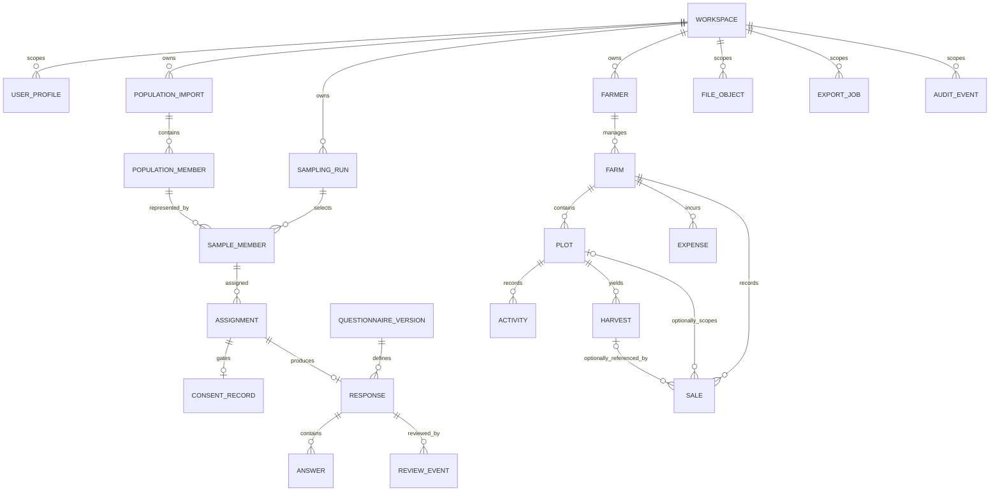
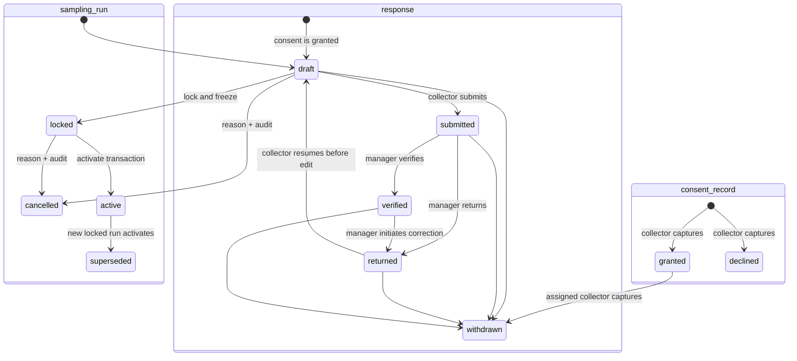

# Data model

## Conceptual ERD

Diagram ย่อความสัมพันธ์เพื่ออ่านง่าย; foreign key และ authorization scope เป็นข้อบังคับแม้เส้นไม่แสดงครบ

## Common fields and keys

ทุก entity ใช้ opaque UUID primary key Root aggregate ต้องมี non-null `workspace_id` FK: `population_import`, `sampling_run`, `questionnaire_version`, `farmer`, `farm`, `export_job`, `file_object`, `audit_event`; V1 ทุกค่าชี้ workspace เดียว Child ต้องสืบ workspace ด้วย immutable parent FK และห้ามเชื่อมข้าม workspace

Important mutable records มี `created_at`, `created_by`, `updated_at`, `updated_by`, `deleted_at`, `deleted_by`, `delete_reason`; timestamps เป็น UTC และ soft-delete field เป็น null เมื่อ active Append-only event ใช้ `occurred_at`, `actor_id` แทน update/delete fields Verified research state ไม่ถูกแก้ตรง: correction สร้าง revision/event พร้อม reason, actor, before/after digest และรักษาค่าเดิม

## Data dictionary

| Entity | Key fields / meaning | Rules |
|---|---|---|
| `workspace` | `id`, `name`, `status` exactly `active\|inactive` | ก่อน bootstrap อนุญาต 0 active ชั่วคราว; หลัง bootstrap V1 ต้องมี exactly one active workspace และไม่มี tenant UI |
| `user_profile` | stable profile `id`, replaceable `auth_user_id`, `workspace_id`, `role`, `status` exactly `active\|inactive`, `must_change_password` | role enum เท่ากับ 5 บทบาท; unique active membership ใน V1; recovery preserves profile UUID and relinks Auth UID ผ่าน recovery-only operation |
| `population_import` | `source_label`, `input_digest`, counts, `status` | ไม่มี raw file public; validation result immutable เมื่อ accepted |
| `population_member` | stable `farmer_code`, `stratum_code`, `eligible`, exclusion reason, protected contact fields | `farmer_code` unique ต่อ accepted snapshot; PII restricted; deterministic sort ใช้ UTF-8 bytewise |
| `sampling_run` | `workspace_id`, `version`, population FK, N/e/target, `seed_text`, `seed_normalized`, `seed_digest_hex`, `seed_u32`, `algorithm_version`, `ordered_candidate_set_hash`, `ordered_result_hash`, `result_evidence`, `status`, `locked_at` | status exactly `draft\|locked\|active\|superseded\|cancelled`; identifier `sha256-mulberry32-fy-v1`; `ordered_result_hash` top-level ต้องตรงกับ `result_evidence.ordered_result_hash` ซึ่งใช้ contract `ordered-result-sha256-v1` และไม่เปลี่ยน selection algorithm; `locked_at` เป็น UTC `timestamptz` ที่ตั้งหนึ่งครั้งเมื่อ `draft→locked` และแก้ไม่ได้; input/result immutable after lock; active exactly one/workspace เมื่อเริ่ม sampling |
| `sample_member` | `sampling_run_id`, `population_member_id`, `stratum_code`, `selection_order` | unique member/run and unique order/run; allocation totals target_n |
| `assignment` | `sample_member_id`, `collector_id`, `status`, due date | reassignment append event + current pointer; one active assignment/sample |
| `consent_record` | `assignment_id`, `decision`, `captured_at`, `collector_id`, `notice_version`, `withdrawn_at` | decision `granted\|declined\|withdrawn`; notice presentation precedes decision; granted precedes baseline/response; decline ends collection; withdrawal terminal |
| `questionnaire_version` | `version_code`, approval metadata, `schema_digest`, `status` | actual questions live in separately approved artifact; approved version immutable |
| `response` | assignment/questionnaire FKs, `status`, `revision_no`, submit/verify/withdraw metadata | collector content mutation only in `draft` with granted consent/valid assignment; `returned→draft` is status-only and preserves content/baseline; manager changes review status but never answer; verified correction preserves snapshot; withdrawal locks |
| `answer` | `response_id`, `question_code`, `value_type`, typed value column | unique question/response; exactly one compatible typed value |
| `review_event` | response, action, reason, actor UUID, UTC timestamp, before/after status+digests | append-only; submitted-return, verified-correction initiation and withdrawal require reason; full correction chain linked |
| `farmer` | `workspace_id`, `owner_user_id`, optional baseline assignment FK, profile fields | farmer owner-scoped; assigned collector edits baseline only after granted consent/valid assignment in response `draft`; resume from returned preserves fields; PII separated from report projection |
| `farm` | farmer, optional baseline assignment FK, location label (non-public), area | area `decimal(14,3)`; farmer owner or assigned collector after granted consent/valid assignment in `draft`; resume from returned preserves fields; no invented public map |
| `plot` | farm, code/name, area, status | area `decimal(14,3)`; unique code/farm; child totals may not exceed farm area when both known |
| `activity` | plot, activity date/type, notes | Gregorian date; active records only in operational views |
| `expense` | farm, optional plot/activity, category, amount, expense date | `amount decimal(14,2)` and non-negative; active rows reduce cash profit |
| `harvest` | plot, harvest date, weight | `weight decimal(14,3)` and positive |
| `sale` | required `farm_id`, optional `plot_id`, optional one `harvest_id`, sale date, quantity, unit_price, gross_amount, deductions, net_amount | plot/harvest (if present) must belong to same farm; quantity `decimal(14,3)`; all monetary fields `decimal(14,2)`; sole revenue source |
| `file_object` | bucket/path, purpose, aggregate type/id, checksum, size, status | private; opaque path; authorization from referenced aggregate |
| `export_job` | kind, filter digest, requested/completed actor/time, row count, status | `anonymized` default; full PII privileged and audited |
| `audit_event` | actor, action, subject, reason, before/after digest, occurred_at | append-only, no secret/raw answer dump |

## Status lifecycles

Population snapshot เป็น version chain ไม่ย้อนแก้ `sampling_run` มีค่าเท่านั้น `draft|locked|active|superseded|cancelled`: draft editable; lock freeze input/candidate/result; transaction activate ทำ active เดิมเป็น superseded; partial unique constraint ป้องกันมากกว่าหนึ่ง active และ workspace invariant บังคับให้ workspace เดียวที่เริ่ม sampling มี active exactly one; cancelled terminal/ไม่ selectable; superseded ใช้ historical analysis ที่เลือกอย่างชัดเจน Assignment: `assigned → in_progress → completed`; `assigned|in_progress → reassigned|cancelled` ต้องมี reason Notice presentation ต้องเกิดก่อน Consent decision `granted|declined`; `declined` จบ collection และ baseline/response FK/check ต้องมี granted consent Withdrawal เปลี่ยน current consent/response เป็น terminal `withdrawn` Response ไม่มีสถานะ consented และมีค่าเท่านั้น `draft|submitted|returned|verified|withdrawn`; collector content edit เฉพาะ `draft`, `returned→draft` เปลี่ยน status เพียง field เดียวและต้อง preserve answer/baseline, manager ทำ `submitted→returned|verified` และ correction `verified→returned` โดยไม่แก้ answer, collector edit/submit หลัง resume, manager re-verifies; withdrawal เข้าได้ exactly จาก `draft|submitted|returned|verified` Soft-delete ไม่ใช้แทน withdrawal

Farm recordsมี lifecycle `active → deleted`; restore ต้อง privileged, reasoned และ audited หากมีผลต่อรายงาน Ledger report นับเฉพาะ active rows (`deleted_at IS NULL`)

## Questionnaire and typed answers

`question_code` stable ข้าม version เมื่อความหมายเดิม; เปลี่ยนความหมายต้อง code ใหม่ `value_type` เป็น `text|integer|decimal|boolean|date|single_choice|multi_choice` Typed column ที่สอดคล้องมีค่าเพียงหนึ่ง; multi-choice เก็บ array ของ approved option codes ไม่เก็บ label เป็นค่าหลัก Codebook ระบุ code, version range, type, required/validation, option code/label และ analysis treatment โดยไม่ฝังคำถามจริงใน repository ก่อน approval

## Numeric, date, and formula invariants

- Money ทุก field รวม `expense.amount`, `sale.unit_price`, `sale.gross_amount`, `sale.deductions`, `sale.net_amount` ใช้ `decimal(14,2)` และ round half-up ที่ transaction boundary; weight/quantity/area ทุก field ใช้ `decimal(14,3)` ห้าม schema เลือก precision อื่นโดยไม่มี requirement change
- `sale.gross_amount = round(quantity * unit_price, 2)`; `net_amount = gross_amount - deductions` และห้ามติดลบโดยไม่มี explicit adjustment policy ที่อนุมัติ
- Cash profit ช่วง `[from_date, to_date]` = `SUM(active sales.net_amount) - SUM(active expenses.amount)` โดยใช้ business date แบบ Gregorian และรวมปลายทั้งสองวัน Sale เป็น revenue source เดียว; harvest ไม่สร้างรายรับ
- Persist business date เป็น Gregorian `date`, event เป็น UTC `timestamptz`; แปลง พ.ศ./Asia-Bangkok เฉพาะ presentation
- Sample target `n = ceil(N / (1 + N e^2))`; allocation ต่อ stratum ใช้ largest remainder และผลรวมต้องเท่ากับ n รายละเอียด tie-break/seed อยู่ใน [research protocol](RESEARCH_PROTOCOL.md)

## Integrity and deletion

Unique constraint, FK, check constraint และ transaction บังคับ invariant; client validationเป็นเพียง feedback Idempotency key unique ต่อ assignment/submit action ป้องกันส่งซ้ำ ไม่มี hard delete ผ่าน product UI สำหรับ important record Retention/hard deletion ต้องผ่าน approved schedule ตาม [Security and PDPA](SECURITY_PDPA.md); หากลบตามสิทธิ ให้เก็บ minimal non-PII tombstone/audit ตามกฎหมายและ protocol ที่อนุมัติ
